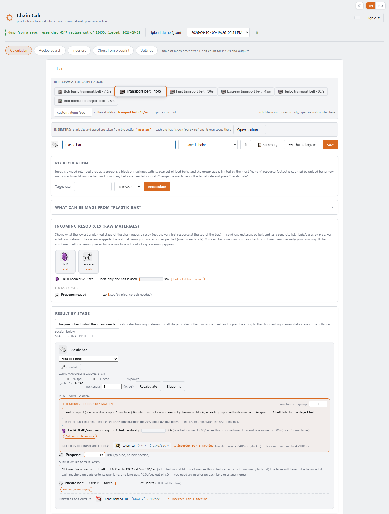
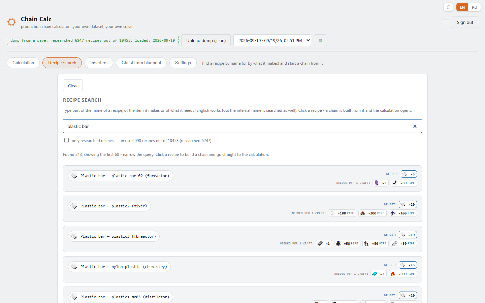
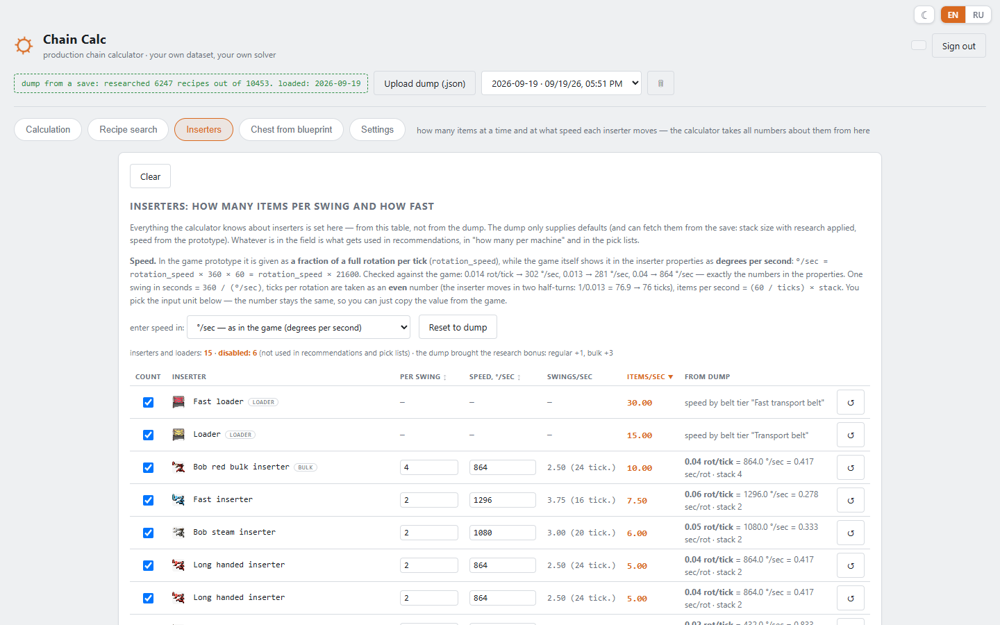

# Chain Calc — Factorio production chain calculator

**English** · [Русский](README.ru.md)

A web calculator for Factorio production chains. You pick what you want to make and how much per second or
minute; it builds the whole tree down to raw resources and tells you how many machines, belts, inserters,
modules and beacons you need — for **your** game, with **your** mods (works great with Pyanodon's).

It runs on your own computer, in the browser.

| Recipe search | Inserters and loaders |
|---|---|
|  |  |

> **Status: early version.** It was developed and tested only with **Pyanodon's** mod set (with Bob's) on a
> single save. Vanilla and other mod packs should mostly work, but there may be bugs. If something is off — a
> wrong number, a missing recipe, a crash — please tell me: a [bug report](../../issues/new/choose) or a thread in
> [Discussions](../../discussions) with your mod list helps a lot. Ideas and suggestions are welcome too.

## What it does

- Builds a production tree from any recipe and solves it, loops included (byproducts, recycling, fuel and ash).
- Machines, modules, beacons, productivity, fuel for burner machines (feed and ash removal are counted).
- Belts and fluids: how many belts per input and output, which belt tier is enough.
- Inserters and loaders: how many per machine, a section where you set which ones you have (stack bonus, speed).
- Ready-to-paste **blueprints** of the layout (needs a full or save dump).
- **Request chest for the whole chain**: one button collects everything the chain needs to build (machines, belts, inserters, poles, modules, beacons) into a single requester chest and copies its blueprint string to the clipboard.
- **Request chest for any blueprint**: paste a blueprint string into the *Chest from blueprint* tab and get a requester chest with everything that blueprint consists of.
- **"Assemble everything" mall**: one assembler per building recipe with a request chest and a supply chest (the *Chest from blueprint* tab).
- Recipe search by name, product or ingredient; saved chains; "only researched recipes" mode.
- English / Russian interface (auto-detected, switch in the corner), dark theme, phone layout.

## Quick start (Windows)

1. Download this repository (green **Code** button → *Download ZIP*) and unpack it, or clone it.
2. Double-click **`start.bat`**.

On the first run it downloads everything it needs by itself (about 100 MB, once): a private Python (only if you
don't have 3.9+) and the packages. Nothing is installed system-wide. The page opens at <http://127.0.0.1:8010>.

## Get your game data

The calculator needs the recipes of your game. Close Factorio and run one of:

| Script | Gives | You do |
|---|---|---|
| **`dump_full.bat`** | every recipe of your mod set + building geometry (for blueprints) | nothing, it is automatic |
| **`dump_from_save.bat`** | the same, plus **what is researched**, inserter stack bonus | pick a save from the list |

Then refresh the page and pick the new dump at the top. Details: [docs/dumps.md](docs/dumps.md).

## Plans

- Better **blueprint generation** (layouts of more kinds of blocks, fewer manual fixes).
- Launching the calculator as a **public website**, so it can be used without installing anything.

Changes of every version are in the [changelog](CHANGELOG.md).

## Documentation

- [How to use the calculator](docs/usage.md)
- [Dumps: full vs from a save](docs/dumps.md)
- [Troubleshooting](docs/troubleshooting.md)

## Feedback

Questions, ideas and bug reports are welcome in [Discussions](../../discussions) (English and Russian
categories) and [Issues](../../issues).

## License

[PolyForm Noncommercial 1.0.0](LICENSE) — use, modify and share freely for **non-commercial** purposes.
Commercial use needs the author's permission. If you publish a copy or a modified version, keep the `LICENSE`
file with its `Required Notice` line (it links back to this project; author: Spikes, GitHub: [Spikes-hub](https://github.com/Spikes-hub)).
