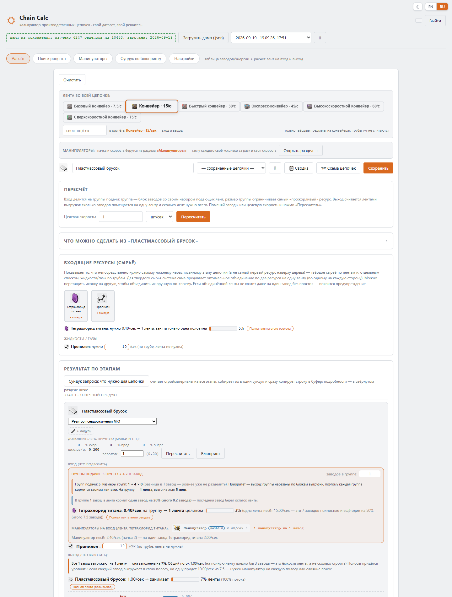
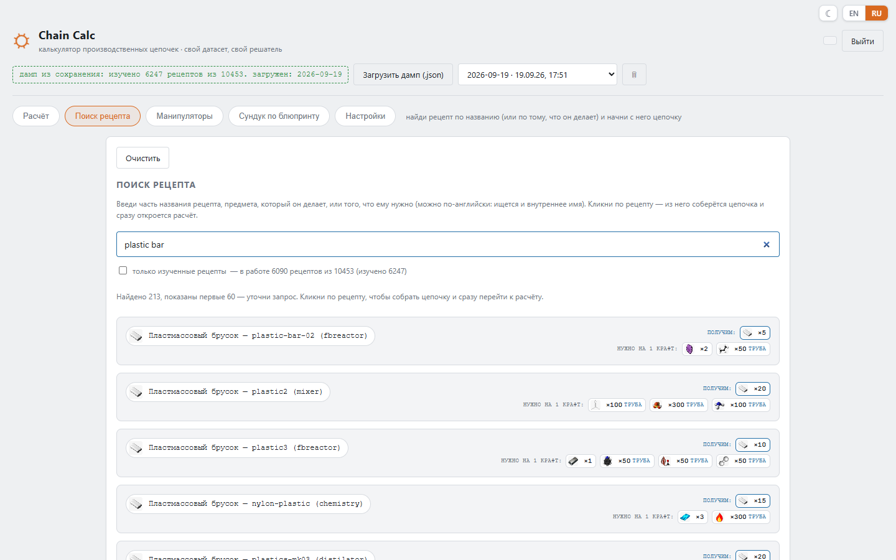
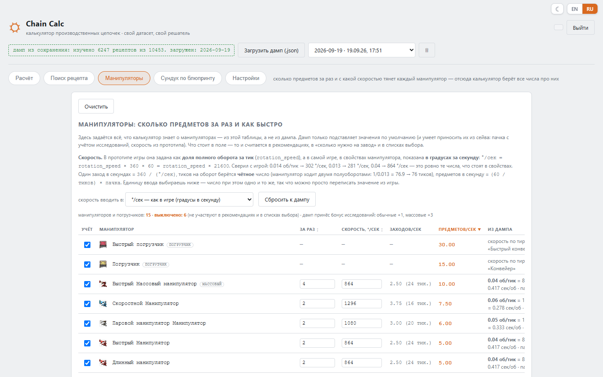

# Chain Calc — калькулятор производственных цепочек Factorio

[English](README.md) · **Русский**

Веб-калькулятор производственных цепочек Factorio. Выбираешь, что хочешь делать и сколько в секунду или минуту,
он строит всё дерево до сырья и считает, сколько нужно заводов, лент, манипуляторов, модулей и маяков — для
**твоей** игры и **твоих** модов (отлично работает с Pyanodon).

Работает на твоём компьютере, в браузере.

| Поиск рецепта | Манипуляторы и погрузчики |
|---|---|
|  |  |

> **Статус: ранняя версия.** Разрабатывалась и проверялась только на наборе модов **Pyanodon** (с Bob's) на одном
> сохранении. С ванилью и другими сборками в основном должна работать, но возможны баги. Если что-то не так —
> неверное число, пропавший рецепт, вылет — напиши: [баг-репорт](../../issues/new/choose) или тема в
> [Discussions](../../discussions) со списком твоих модов очень поможет. Идеи и предложения тоже приветствуются.

## Что умеет

- Строит дерево производства из любого рецепта и решает его, включая петли (побочные продукты, переработка, топливо и зола).
- Заводы, модули, маяки, продуктивность, топливо для горящих заводов (подача и вывоз золы считаются).
- Ленты и жидкости: сколько лент на вход и выход, какого тира хватит.
- Манипуляторы и погрузчики: сколько на завод; раздел, где задаёшь, какие у тебя есть (бонус стека, скорость).
- Готовые **блюпринты** раскладки для вставки в игру (нужен полный дамп или дамп из сохранения).
- **Сундук запроса на всю цепочку**: одна кнопка собирает всё, что нужно для постройки (заводы, ленты, манипуляторы, столбы, модули, маяки), в один сундук запроса и копирует его строку в буфер.
- **Сундук запроса по любому блюпринту**: вставляешь строку блюпринта на вкладке «Сундук по блюпринту» и получаешь сундук запроса со всем, из чего он состоит.
- **«Сборщики всего»**: по автомату на каждый рецепт построек, с сундуком запроса и сундуком снабжения (вкладка «Сундук по блюпринту»).
- Поиск рецепта по названию, продукту или ингредиенту; сохранённые цепочки; режим «только изученные рецепты».
- Интерфейс на русском и английском (определяется сам, переключатель в углу), тёмная тема, вёрстка для телефона.

## Быстрый старт (Windows)

1. Скачай репозиторий (зелёная кнопка **Code** → *Download ZIP*) и распакуй, или склонируй.
2. Дважды щёлкни **`start.bat`**.

При первом запуске он сам скачает всё нужное (около 100 МБ, один раз): свой Python (если нет 3.9+) и пакеты.
В систему ничего не ставится. Страница откроется на <http://127.0.0.1:8010>.

## Данные твоей игры

Калькулятору нужны рецепты твоей игры. Закрой Factorio и запусти один из скриптов:

| Скрипт | Что даёт | Что делаешь |
|---|---|---|
| **`dump_full.bat`** | все рецепты набора модов + геометрия построек (для блюпринтов) | ничего, всё автоматически |
| **`dump_from_save.bat`** | то же, плюс **что изучено**, бонус стека манипуляторов | выбираешь сохранение из списка |

Потом обнови страницу и выбери новый дамп сверху. Подробнее: [docs/dumps.ru.md](docs/dumps.ru.md).

## Планы

- Улучшить **генерацию блюпринтов** (раскладки для большего числа видов блоков, меньше ручных правок).
- Запустить калькулятор как **публичный сайт**, чтобы им можно было пользоваться без установки.

Что менялось в каждой версии — в [истории изменений](CHANGELOG.ru.md).

## Документация

- [Как пользоваться](docs/usage.ru.md)
- [Дампы: полный и из сохранения](docs/dumps.ru.md)
- [Если что-то не работает](docs/troubleshooting.ru.md)

## Обратная связь

Вопросы, идеи и баги — в [Discussions](../../discussions) (категории на русском и английском) и в
[Issues](../../issues).

## Лицензия

[PolyForm Noncommercial 1.0.0](LICENSE) — пользоваться, менять и распространять можно свободно, но только
**некоммерчески**. Для коммерческого использования нужно разрешение автора. Если выкладываешь копию или
изменённую версию — сохрани файл `LICENSE` со строкой `Required Notice` (в ней ссылка на оригинал, автор — Spikes).
